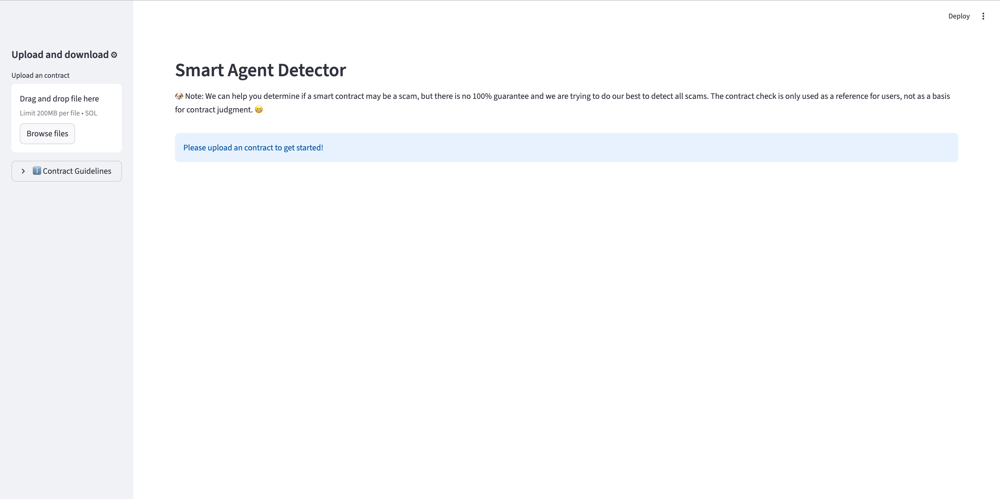
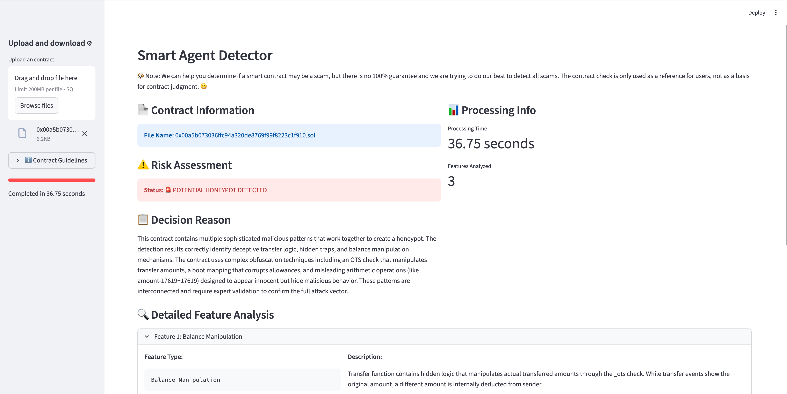
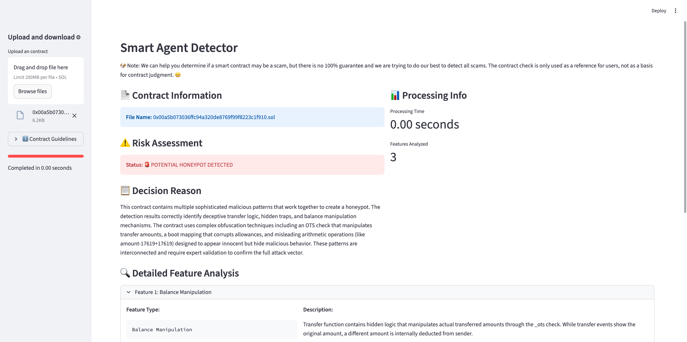
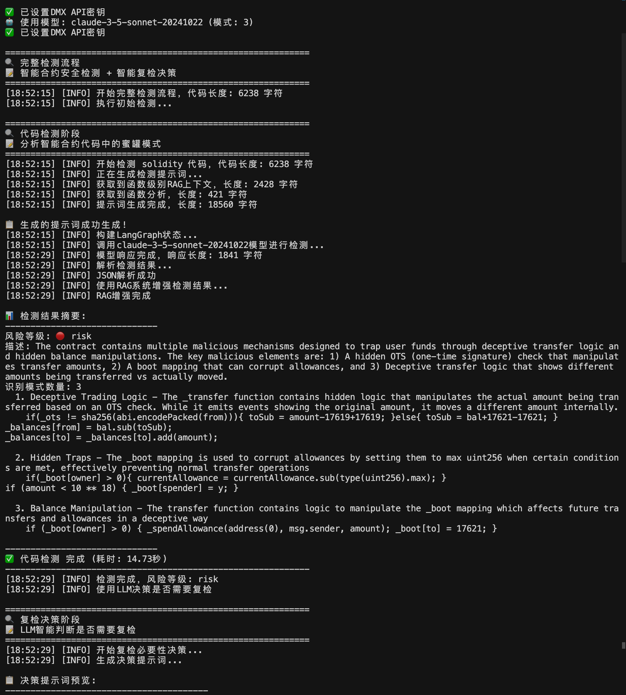
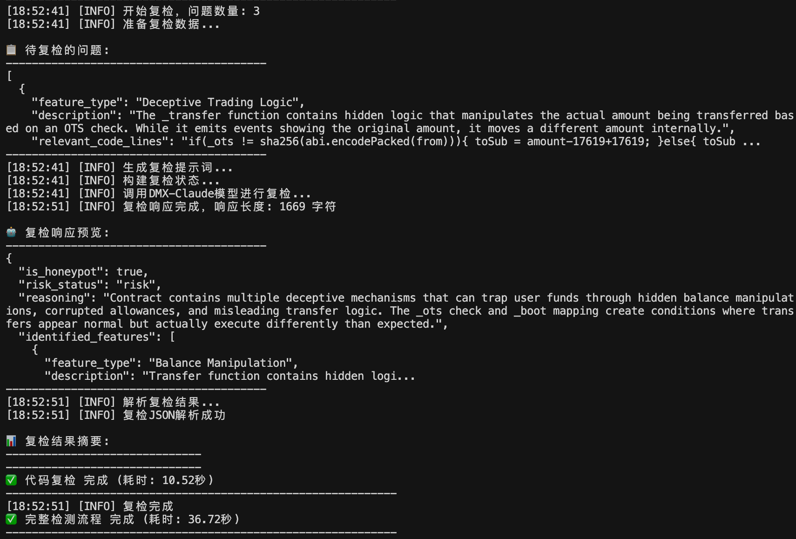
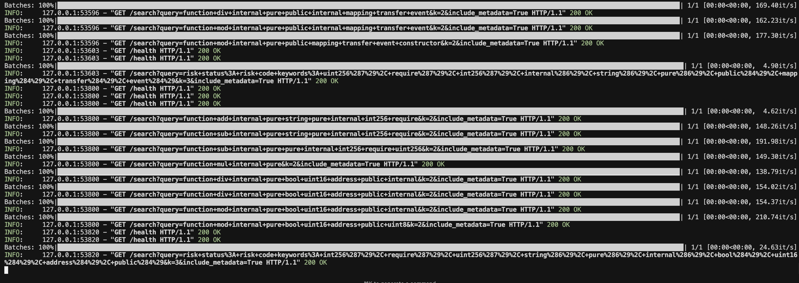

# Smart Contract Security Detection System

An AI-powered smart contract security analysis system that detects honeypots and malicious patterns using advanced machine learning technologies.

## Demo

### Video Demonstration
[Demo Video Link](https://youtu.be/4xzw-6WYDWg)

### Screenshots

#### Main Interface Display

The main detection interface showing the input area, configuration options, and start detection controls.

#### Non-Hit Database Running Results

Display of analysis results when the contract is not found in the database, showing full AI analysis process.

#### Hit Database Running Results

Display of analysis results when the contract matches existing database records, showing cached results and quick reference information.

#### Background Processing Log Display

Real-time background processing logs showing the detection workflow, model inference steps, and system status updates.

#### RAG Query Process Display

Detailed view of the RAG (Retrieval-Augmented Generation) query process, including vector search, context retrieval, and AI reasoning steps.

## Features

- **Intelligent Analysis**: Automated detection of malicious patterns in smart contracts
- **Honeypot Detection**: Identifies fund-trapping mechanisms and deceptive behavior
- **Smart Review System**: Automatically determines if secondary verification is needed
- **Batch Processing**: Analyze multiple contracts simultaneously
- **Real-time Monitoring**: Live progress tracking and statistics
- **Detailed Reports**: Comprehensive security analysis with actionable insights
- **Checkpoint Support**: Resume interrupted analysis sessions
- **Multiple Operation Modes**: Development, testing, and production environments

## What It Does

### Detects

- Malicious fund-trapping mechanisms
- Deceptive trading logic
- Hidden backdoors and access control risks
- Tax anomalies and trading restrictions
- Owner privilege abuse patterns
- And so on...

### Provides

- Accurate risk classification (Risk/Safe/Suspicious)
- Detailed reasoning for each detection
- Relevant code sections with line numbers
- Comprehensive evaluation metrics
- Actionable security recommendations

## Use Cases

- Smart Contract Security Auditing
- Token Security Verification
- DeFi Protocol Risk Analysis
- Honeypot Detection Research
- Security Compliance Checking

## Project details

**The project has not yet opened.**

## Performance

- Handles large-scale contract analysis
- Processes multiple contracts concurrently
- Memory-efficient for large datasets

## Contributing

We welcome contributions!

## License

This project is licensed under the MIT License - see the [LICENSE](LICENSE) file for details.

## Contact

For questions or suggestions:
- Open an [Issue](https://github.com/your-username/web3-agent/issues)
- Email: ruixia4976@gmail.com

## Changelog

### v2.0.1 (2024-10-24)

- Enhanced detection accuracy
- Improved user interface
- Better performance and reliability
- Front-end interface display

### v2.0.0 (2024-09-22)
- Advanced AI detection capabilities
- Multi-mode operation support
- Enhanced batch processing

---

**If you find this project helpful, please give it a star!**
